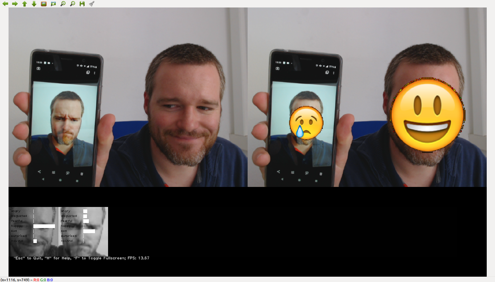

# ML² Face Emoji Swap

Dieses Projekt ist innerhalb des Weiterbildungsprojektes "Menschen Lernen Maschinelles Lernen" ([ML²][ML2]) an der Hochschule Offenburg entstanden. Das Projekt dient primär als Demonstrator auf Messen und sonstigen öffentlichen Veranstaltungen, um das Thema Machine Learning dem Publikum näher zu bringen.
Als Zielplattform wird NVIDIA Jetson TX2 verwendet. Die Applikation kann jedoch auf beliebige Systeme ausgeführt werden, da diese von einer Python-Umgebung abhängt.


## Inspiration

Die Idee für das Projekt sowie verschiedene Ressourcen stammen aus dem GitHub Repository [emotion-recognition-neural-networks][emotion-recognition-neural-networks]


## Vorbereitung Jetson TX2

Die Jetson TX2 Plattform wurde entsprechend der [NVIDIA Anleitung](https://docs.nvidia.com/jetson/archives/jetpack-archived/jetpack-33/index.html#jetpack/3.3/introduction.htm%3FTocPath%3D_____1) mit dem JetPack Tool aufgesetzt. Zuerst wird ein vorbereitetes Linux Image in den Speicher geflasht. Außerdem kann man für das System Software-Bibliotheken (OpenCV, cuDNN, TensorRT) mit entsprechendem Beispielcode installieren. Daraufhin ist das System zur Verwendung bereit.


##### Hinweis  

Da sich das System nach einem Update der Software-Bibliotheken mit ````sudo apt-get update && sudo apt-get upgrade```` in einen fehlerhaften Zustand befand, wurde auf diesen Schritt verzichtet. Aufgrund dessen müssen bestimmte Systempakete manuell installiert werden, bevor die Python-Komponenten installiert werden können.


## Python-Umgebung Jetson TX2

Die von [NVIDIA][install-tf-jetsontx2] unterstützte Python-Version für das Jetson TX2 ist Version 3.5. Zudem wird auch ein vorkompiliertes Tensorflow in der Version 1.09 bereitgestellt. Somit stellt dies die Standardkonfiguration für die Python-Umgebung dar. Nachfolgend wird diese Umgebung für das Jetson TX2 erstellt.
 
* OpenCV On Jetson TX2  
Da die in JetPack mitgelieferte OpenCV-Bibliothek nur für die Python2 Version ausgelegt ist, wird in diesem Schritt eine neuere Version entsprechend der [Anleitung][opencv3_on_tx2] installiert.
 
* Installation alle benötigten Pakete  
```
 sudo apt-get update && sudo apt-get install liblapack-dev \
libblas-dev \
libfreetype6-dev \ 
libhdf5 \
virtualenv \
python3-dev \
python3-pip \
```


* Erstellen der Python-Umgebung  
```
# Python 3.5 Umgebung unter USER_HOME/dev/py3_keras erstellen
virtualenv --python=python3 ~/dev/py3_keras 
#
# Umgebung aktivieren
source ~/dev/py3_keras/bin/activate
#
pip --version 
# pip 18.1 from /home/nvidia/dev/py3_keras/lib/python3.5/site-packages/pip (python 3.5)
#
python --version
# Python 3.5.2
#
# Installation aller benötigten Pythonpakete
pip install keras pillow matplotlib pandas scikit-learn 
#
# Installation von Tensorflow für Jetson TX2 
pip install --extra-index-url https://developer.download.nvidia.com/compute/redist/jp33 tensorflow-gpu
#
# OpenCV der Umgebung hinzufügen
ln -s /usr/local/lib/python3.5/dist-packages/cv2.cpython-35m-aarch64-linux-gnu.so \
     ~/dev/py3_keras/lib/python3.5/site-packages/cv2.cpython-35m-aarch64-linux-gnu.so  
```


## Python-Umgebung Windows

1. Installation von [Python 3.5](https://www.python.org/) direkt oder  mit [Anaconda Distribution](https://www.anaconda.com/distribution/#download-section) eine Python 3.5 Umgebung erstellen. 
2. Mittels ``pip`` die benötigten Pakete installieren:

````
pip install keras==2.2.4 tensorflow==1.9.0 pillow matplotlib pandas scikit-learn opencv-python
````

 
## ml2_face_emoji_swap.py

Das Hauptskript für den Demonstrator stellt die Datei `ml2_face_emoji_swap.py` dar. Das Skripts kann mit der vorbereiteten Python-Umgebung folgenderweise ausgeführt werden: `python ml2_face_emoji_swap.py`.

* __Pretrained Network__  
Das Skript ``ml2_face_emoji_swap.py`` benötigt zur Ausführung ein künstliches Neuronales Netzwerk. In dem ZIP-Archiv [EmotionClassifier-EP35-ACC0.68.zip](https://bwsyncandshare.kit.edu/dl/fiLA4wRYWBKVzphjPKPoRVPq/EmotionClassifier.zip) liegt ein vortrainiertes Modell `EmotionClassifier.hdf5` sowie zusätzliche Trainingsinformationen `model_history.png` und `model_summery.txt` bereit. Um schließlich den Demonstrator starten zu können, wird das Modell in den `./data/` Ordner abgelegt sowie das Skript wie beschrieben gestartet.

Zusätzliche Parameter und Beschreibung sind in dem folgenden *help*-Ausgabe aufgeführt.
```  
usage: ml2_face_emoji_swap.py [-h] [--cam-dev CAM_DEV] [-i IMAGE]
                              [-id IMAGE_DIRECTORY]

This script, mainly aimed as a demonstrator at exhibitions, is executed on the
Nvidia Jetson TX2 system. With this script a task in the field of machine
leaning is performed. Firstly, an object detector is used to detect faces in a
camera stream. Secondly, all detected faces are classified by an earlier
trained artificial neural network in few emotion classes like angry and
happy.In a last step, the face will now be replaced by a equivalent emoji,
e.g. if the face is classified as angry the angry emoji will replace the face.
The resulted image with all replaced faces is than displayed in a window

optional arguments:
  -h, --help            show this help message and exit
  --cam-dev CAM_DEV     The device number of the camera which should be used.
                        By the Default=1 an usb Webcam on Jetson TX2 will be
                        used.
  -i IMAGE, --image IMAGE
                        runs the detection and classification task on an
                        image, mainly as debugging purpose.
  -id IMAGE_DIRECTORY, --image-directory IMAGE_DIRECTORY
                        runs the detection and classification task on a whole
                        directory with multiple images in an endless loop.

```
 


Nach dem Start der Anwendung öffnet sich ein Fenster mit der entsprechenden Ausgabe. Das Bild links oben zeigt das rohe Kamerabild. Das Bild rechts oben zeigt das Resultat der Verarbeitung. Die Bilderserie im unteren Bereich gibt die Klassen der erkannten Gesichtern wieder. Bis ein Ergebnisbild vorliegt ist das Rohbild durch unterschiedliche Operationsstufen gelaufen.  
 
1. Gesichtserkennung mittels [OpenCV][tutorial_py_face_detection] und *Haar Cascades*
2. Extrahieren der erkannten Gesichter im Bild.
3. Klassifikation der Gesichter in die unterschiedlichen Emotionen durch ein Künstliches Neuronales Netzwerk.  
4. Ersetzen der Gesichtsregionen im Rohbild mit dem entsprechendem Emoji der erkannten Klasse.
5. Ausgabe erstellen und visualisieren.

 
 
Der Ablauf des Programms kann durch folgenden Tasten gesteuert werden:
* `ESC` Beendet die Programmausführung.
* `h` Hilfetext ein- o. ausblenden.
* `f` Anwendung in Fullscreen versetzten.
* `1-4` __experimentell__ Auswahl des haar-cascade Datei für die Gesichtserkennung.

## Weitere Artefakte

* Jupyter Notebooks:  
 Voraussetzung: `./data/data_image.npy` und `./data/data_labels.npy` müssen vorliegen.
    * Das Notebook `dataset.ipynb` liegt zur explorativen Datenanalyse bereit. 
    * Mit dem Notebook ``model_training.ipynb`` kann eine Modell zur Klassifikation von Emotionen trainiert werden.

* Das Skript ``csv_to_numpy.py`` dient zur Verarbeitung des rohen Trainingsdatensatzes [FER2013][fer2013] (fer2013.csv (~36000 48x48pixel Bilder)), zu den für das Training benötigten `./data/data_image.npy` und `./data/data_labels.npy` Dateien. Zunächst werden die Pixelinformationen aus der CSV-Datei extrahiert und anschließend zu einem Bild konvertiert. In einem zweiten Schritt findet eine Filterung der Bilder mittels OpenCV und Face Detection statt, um die Qualität des Datensatz zu verbessern. Das bedeutet es werden nur Bilder genutzt, in denen OpenCV Gesichter erkennt. Abschließend werden die erwähnten Dateien generiert. Die Filterung hat zur Folge, dass nur noch rund 14000 Bilder bei Modellerstellung verfügbar sind.
         
* Die Datei ``dataset_loader.py`` enthält die Klasse DatasetLoader, welche beim Training des Modells das Dataset (*.npy Dateien) lädt sowie in Trainings- set und Testset aufteilt.

* Die Datei ``emotion_classifier.py`` enthält die Klasse EmotionClassifier. In vorhergehenden Versionen wurde die Datei genutzt, um ein Training durchzuführen. Dies Schritt wurde durch das Notebook `model_training.ipynb` ersetzt.

* In dem Ordner ``./haarcascade_files/`` liegen die von OpenCV bereitgestellten Cascade-Dateien für die Gesichtserkennung bereit.

* In dem Ordner ``./emojis/`` liegen die Emoji-Bilder vor. Jeder Emoji repräsentiert eine Klasse und erstsetzt ein Gesicht im Bild.  

## TODOs

1. Die Gesichtserkennung mit einem künstlichen Neuronalen Netz umsetzen.  
1.1 oder vielleicht noch besser ein komplettes Modell für Gesichtserkennung und Klassifikation in die unterschiedlichen Emotionen. 

2. Besseres Modell für die Klassifikation  
2.1 AffectNet Database liegt bereit


## Referenzen

[emotion-recognition-neural-networks][emotion-recognition-neural-networks]  
[fer2013][fer2013]  
[opencv3_on_tx2][opencv3_on_tx2]  
[tutorial_py_face_detection][tutorial_py_face_detection]  
[install-tf-jetsontx2][install-tf-jetsontx2]  
 
[ML2]: https://ml2.hs-offenburg.de/aktuelles/
[emotion-recognition-neural-networks]: https://github.com/isseu/emotion-recognition-neural-networks
[fer2013]: https://www.kaggle.com/c/challenges-in-representation-learning-facial-expression-recognition-challenge
[opencv3_on_tx2]: https://jkjung-avt.github.io/opencv3-on-tx2/
[tutorial_py_face_detection]: https://docs.opencv.org/3.4.3/d7/d8b/tutorial_py_face_detection.html
[install-tf-jetsontx2]: https://docs.nvidia.com/deeplearning/dgx/install-tf-jetsontx2/index.html